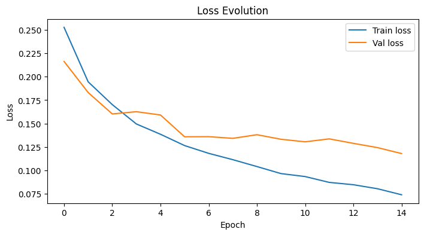
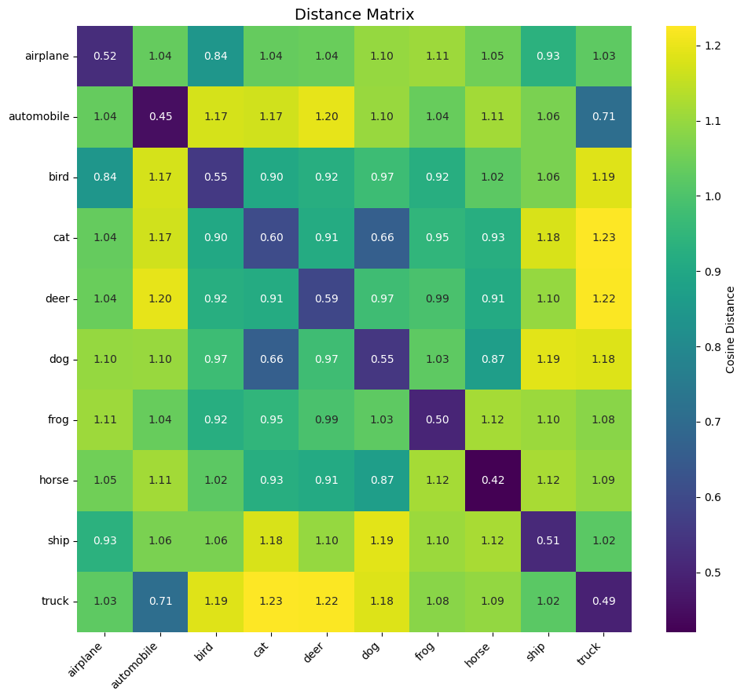
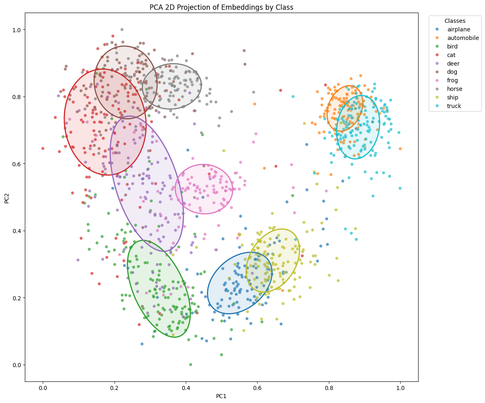
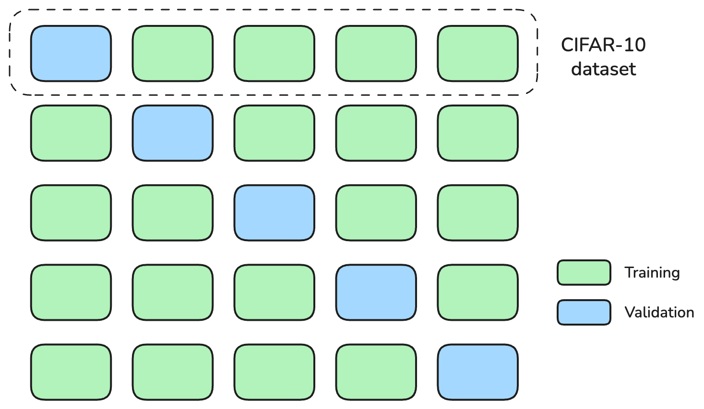
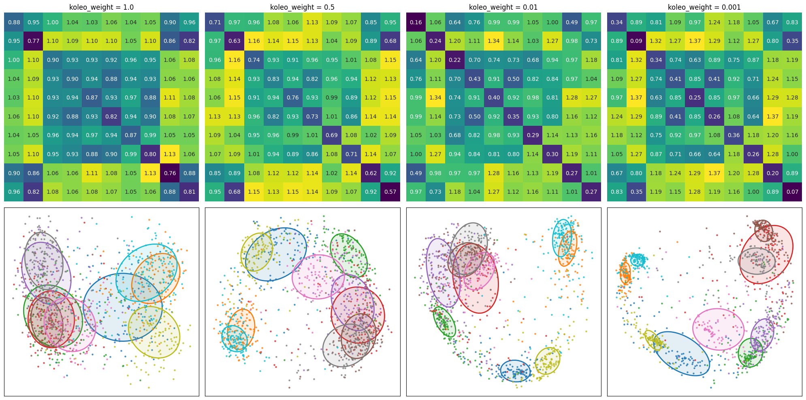

# The KoLeo loss

The KoLeo loss is a regularizer that pushes representations to spread uniformly in their space by maximizing their minimum distance from each other.

## Where does the KoLeo loss come from?

The KoLeo loss was introduced in this [paper](https://arxiv.org/pdf/1806.03198). It is a loss function derived from the Kozachenko–Leonenko estimator. It allows approximating Shannon entropy using distances to the k nearest neighbors. If you want to learn more about this estimator, I recommend visiting this [page](https://infomeasure.readthedocs.io/en/stable/guide/entropy/kozachenko_leonenko/).

The DINO family of self-supervised learning models has implemented this loss which you can find [here](https://github.com/facebookresearch/dinov2/blob/main/dinov2/loss/koleo_loss.py).

The KoLeo loss is defined as follows

$$ \mathcal{L}_{KoLeo} = - \frac{1}{n} \sum_{i=1}^n \log\left( \min_{j \ne i} \| f(x_i) - f(x_j) \| \right). $$

where $n$ is the batch size. For each embedding in the batch, the loss computes the logarithm of its minimum distance to all other embeddings in the same batch. The negative sign ensures that maximizing the minimum distance corresponds to minimizing the loss, encouraging embeddings to spread out in the representation space.

So the total loss becomes

$$ \mathcal{L} = \mathcal{L}_{triplet} + \lambda\mathcal{L}_{KoLeo} $$


One of the key benefits of this loss is preventing *collapse*. Model collapse refers to a failure mode in self-supervised learning where the model learns to map all inputs to the same (or very similar) embedding vector. When collapse occurs, all the learned features are indistinguishable and the model loses its ability to represent meaningful differences between examples, effectively destroying the utility of the learned representations. The KoLeo loss mitigates this by encouraging the embeddings to spread out in the representation space, helping the model avoid this degenerate solution. Here an illustration that comes from the paper:


We will therefore try to integrate the KoLeo loss into our training code and observe the results on our siamese network. Will we observe, as expected, a greater spread of embeddings?

## Integrating the KoLeo loss into the code

First, let's take the KoLeo loss implementation from DINOv2.


```python
import torch
import torch.nn as nn
import torch.nn.functional as F

torch.use_deterministic_algorithms(True)

class KoLeoLoss(nn.Module):
    """Kozachenko-Leonenko entropic loss regularizer from Sablayrolles et al. - 2018 - Spreading vectors for similarity search"""

    def __init__(self):
        super().__init__()
        self.pdist = nn.PairwiseDistance(2, eps=0)

    def pairwise_NNs_inner(self, x):
        """
        Pairwise nearest neighbors for L2-normalized vectors.
        Uses Torch rather than Faiss to remain on GPU.
        """
        # parwise dot products (= inverse distance)
        dots = torch.mm(x, x.t())
        n = x.shape[0]
        dots.view(-1)[:: (n + 1)].fill_(-1)  # Trick to fill diagonal with -1
        _, indices = torch.max(dots, dim=1)  # max inner prod -> min distance
        return indices

    def forward(self, student_output, eps=1e-8):
        """
        Args:
            student_output (BxD): backbone output of student
        """
        student_output = F.normalize(student_output, eps=eps, p=2, dim=-1)
        indices = self.pairwise_NNs_inner(student_output)
        distances = self.pdist(student_output, student_output[indices])  # BxD, BxD -> B
        loss = -torch.log(distances + eps).mean()
        return loss

```


```python
import sys
sys.path.append("../..")

from training_utils import (
    get_device, load_cifar10, build_triplets,
    create_datasets, VGG11Embedding, triplet_loss,
    setup_training_dir, log_metrics, print_metrics, 
    plot_losses, construct_embeddings_by_class, LABEL_NAMES
)

```

### Training

As in part 1, we start by defining the seed and building our triplets.

For the sake of reproducibility, I set the device to CPU here.
As I am on a Mac, I would normally use 'mps', but the KoLeo loss produces slight differences between same runs on 'mps' for unclear reasons. This requires further investigation, so I will keep everything on CPU for this first run. Later, when using k-fold, we will switch to 'mps', sacrificing reproducibility for speed.


```python
import numpy as np

seed = 42
device = get_device()
device = "cpu"
print(f"Device: {device}")

images, labels = load_cifar10("../cifar-10-python")
print(f"Images shape: {images.shape}, Labels shape: {labels.shape}")

np.random.seed(seed)
triplets, triplets_labels = build_triplets(images, labels, n_neg=2500, seed=seed)
print(f"Triplets shape: {triplets.shape}")

```

    Device: cpu
    Images shape: (50000, 32, 32, 3), Labels shape: (50000,)
    Triplets shape: (25000, 3, 32, 32, 3)


Here we add the `koleo_weight` variable, our $\lambda$ parameter of the total loss formula.


```python
batch_size = 64
learning_rate = 5e-4
margin = 0.4
koleo_weight = 0.1
val_split = 0.05

train_dataset, val_dataset, val_triplets, val_labels = create_datasets(triplets, triplets_labels, val_split=val_split, seed=seed)

koleo_loss_fn = KoLeoLoss()

print(f"Train: {len(train_dataset)}, Val: {len(val_dataset)}")
```

    Train: 23750, Val: 1250


And we rewrite our training loop by inserting the KoLeo loss into the loss calculation.


```python
from sklearn.metrics import roc_auc_score
from tqdm import tqdm

def train_loop(net, dataloader, optimizer, margin, koleo_weight, print_freq=100):
    net.train()
    loss_accum = 0.0
    epoch_loss = 0.0
    for batch_idx, (anc, pos, neg) in tqdm(enumerate(dataloader)):
        anc, pos, neg = anc.to(device), pos.to(device), neg.to(device)
        anc_feat, pos_feat, neg_feat = net(anc), net(pos), net(neg)

        t_loss = triplet_loss(anc_feat, pos_feat, neg_feat, margin)
        all_embeddings = torch.cat([anc_feat, pos_feat, neg_feat], dim=0)
        k_loss = koleo_loss_fn(all_embeddings)
        if koleo_weight is not None:
            loss = t_loss + koleo_weight * k_loss
        else:
            loss = t_loss

        optimizer.zero_grad()
        loss.backward()
        optimizer.step()

        loss_accum += loss.item()
        epoch_loss += loss.item()

        if (batch_idx + 1) % print_freq == 0:
            print(f"Batch {batch_idx+1}: Loss = {loss_accum / print_freq:.4f}")
            loss_accum = 0.0

    return epoch_loss / (batch_idx + 1)

def validation_loop(net, dataloader, margin, koleo_weight, device):
    net.eval()
    val_loss = 0
    total_simple_loss = 0
    good_triplets = 0
    total_triplets = 0

    positive_similarities = []
    negative_similarities = []
    
    positive_euclidean_distances = []
    negative_euclidean_distances = []

    with torch.no_grad():
        for batch_idx, (anc, pos, neg) in enumerate(dataloader):
            anc, pos, neg = anc.to(device), pos.to(device), neg.to(device)
            anc_feat, pos_feat, neg_feat = net(anc), net(pos), net(neg)
            
            simple_loss = triplet_loss(anc_feat, pos_feat, neg_feat, margin)
            if koleo_weight is not None:
                loss = simple_loss + koleo_weight * koleo_loss_fn(torch.cat([anc_feat, pos_feat, neg_feat], dim=0))
            else:
                loss = simple_loss

            val_loss += loss.item()
            total_simple_loss += simple_loss.item()

            batch_positive_euclidean_distances = F.pairwise_distance(anc_feat, pos_feat, p=2)
            batch_negative_euclidean_distances = F.pairwise_distance(anc_feat, neg_feat, p=2)
            positive_euclidean_distances.append(batch_positive_euclidean_distances)
            negative_euclidean_distances.append(batch_negative_euclidean_distances)

            batch_positive_similarities = F.cosine_similarity(anc_feat, pos_feat, dim=1)
            batch_negative_similarities = F.cosine_similarity(anc_feat, neg_feat, dim=1)
            positive_similarities.append(batch_positive_similarities)
            negative_similarities.append(batch_negative_similarities)

            good_triplets += (batch_positive_similarities > batch_negative_similarities).sum()
            total_triplets += anc.shape[0]

        positive_euclidean_distances = torch.cat(positive_euclidean_distances, dim=0)
        negative_euclidean_distances = torch.cat(negative_euclidean_distances, dim=0)

        positive_similarities = torch.cat(positive_similarities, dim=0)
        negative_similarities = torch.cat(negative_similarities, dim=0)

        predict_similarities = torch.cat([positive_similarities, negative_similarities], dim=0)
        target_similarities = torch.cat([torch.ones_like(positive_similarities), torch.zeros_like(negative_similarities)], dim=0)

        val_auc = roc_auc_score(target_similarities.detach().cpu().numpy(), predict_similarities.detach().cpu().numpy())
        mean_positive_similarities = predict_similarities[:len(predict_similarities)//2].mean().item()
        mean_negative_similarities = predict_similarities[len(predict_similarities)//2:].mean().item()
        mean_positive_euclidean_distances = positive_euclidean_distances.mean().item()
        mean_negative_euclidean_distances = negative_euclidean_distances.mean().item()
        good_triplets_ratio = (good_triplets / total_triplets).item()
    
    return {
        'val_loss': val_loss / (batch_idx + 1),
        'simple_loss': total_simple_loss / (batch_idx + 1),
        'val_auc': val_auc,
        'mean_positive_similarities': mean_positive_similarities,
        'mean_negative_similarities': mean_negative_similarities,
        'mean_positive_euclidean_distances': mean_positive_euclidean_distances,
        'mean_negative_euclidean_distances': mean_negative_euclidean_distances,
        'good_triplets_ratio': good_triplets_ratio
    }
```

We then configure our directory where runs will be stored before training.


```python
epochs = 15

config = {
    "seed": seed, "batch_size": batch_size, "learning_rate": learning_rate,
    "epochs": epochs, "margin": margin, "koleo_weight": koleo_weight, "val_split": val_split
}
save_dir, metrics_path, csv_headers = setup_training_dir("runs_koleo", config)
```

We can launch the training!

Note that by controlling the random seeds, we ensure that this training run precisely matches the procedure from Chapter 1 in all aspects: model weight initialization, the order of training batches, and image transformations. The only intentional difference in this experiment is the inclusion of the KoLeo loss component. This allows us to perform a fair and direct comparison between the two approaches.


```python
import random

from torch.utils.data import DataLoader
from torchvision.models import VGG11_Weights

train_losses = []
val_losses = []
best_auc = 0
best_epoch_path = None

random.seed(seed)
np.random.seed(seed)
torch.manual_seed(seed)

if torch.cuda.is_available():
    torch.cuda.manual_seed(seed)
if torch.mps.is_available():
    torch.mps.manual_seed(seed)

gt = torch.Generator()
gt.manual_seed(seed)

val_loader = DataLoader(val_dataset, batch_size=batch_size, shuffle=False)
train_loader = DataLoader(train_dataset, batch_size=batch_size, shuffle=True, generator=gt)

net = VGG11Embedding(weights=VGG11_Weights.IMAGENET1K_V1).to(device)
optimizer = torch.optim.Adam(net.parameters(), lr=learning_rate)

val_metrics = validation_loop(net, val_loader, margin, koleo_weight, device)
print(f"Before training")
print_metrics(val_metrics)
log_metrics(metrics_path, csv_headers, 0, "", val_metrics)

for epoch_idx in range(epochs):
    train_loss = train_loop(net, train_loader, optimizer, margin, koleo_weight)
    val_metrics = validation_loop(net, val_loader, margin, koleo_weight, device)
    val_losses.append(val_metrics['val_loss'])
    train_losses.append(train_loss)
        
    print(f"Epoch {epoch_idx+1} - train_loss: {train_loss:.4f}, val_loss: {val_metrics['val_loss']:.4f}, val_auc: {val_metrics['val_auc']:.4f}")
    print_metrics(val_metrics)
    log_metrics(metrics_path, csv_headers, epoch_idx + 1, train_loss, val_metrics)

    if val_metrics['val_auc'] > best_auc:
        best_auc = val_metrics['val_auc']
        if best_epoch_path is not None:
            best_epoch_path.unlink()
        best_epoch_path = save_dir / f'best_epoch_{epoch_idx+1}.pth'
        torch.save(net.state_dict(), best_epoch_path)
        print(f"New best AUC: {best_auc:.4f} at epoch {epoch_idx+1}")
```

    Before training
    Validation metrics — val_loss: 0.3296, simple_loss: 0.3156, val_auc: 0.6642, mean_positive_similarities: 0.2750, mean_negative_similarities: 0.1853, mean_positive_euclidean_distances: 1.1968, mean_negative_euclidean_distances: 1.2714, good_triplets_ratio: 0.6656


    100it [01:57,  1.14s/it]

    Batch 100: Loss = 0.2912


    200it [03:57,  1.14s/it]

    Batch 200: Loss = 0.2490


    300it [05:55,  1.19s/it]

    Batch 300: Loss = 0.2377


    372it [07:17,  1.18s/it]


    Epoch 1 - train_loss: 0.2526, val_loss: 0.2162, val_auc: 0.8592
    Validation metrics — val_loss: 0.2162, simple_loss: 0.1416, val_auc: 0.8592, mean_positive_similarities: 0.5595, mean_negative_similarities: 0.1074, mean_positive_euclidean_distances: 0.8938, mean_negative_euclidean_distances: 1.3127, good_triplets_ratio: 0.8616
    New best AUC: 0.8592 at epoch 1


    100it [01:53,  1.09s/it]

    Batch 100: Loss = 0.2132


    200it [03:50,  1.20s/it]

    Batch 200: Loss = 0.1868


    300it [05:48,  1.14s/it]

    Batch 300: Loss = 0.1880


    372it [07:09,  1.16s/it]


    Epoch 2 - train_loss: 0.1945, val_loss: 0.1831, val_auc: 0.8859
    Validation metrics — val_loss: 0.1831, simple_loss: 0.1214, val_auc: 0.8859, mean_positive_similarities: 0.4965, mean_negative_similarities: -0.0129, mean_positive_euclidean_distances: 0.9633, mean_negative_euclidean_distances: 1.4063, good_triplets_ratio: 0.8864
    New best AUC: 0.8859 at epoch 2


    100it [01:53,  1.15s/it]

    Batch 100: Loss = 0.1772


    200it [03:56,  1.18s/it]

    Batch 200: Loss = 0.1721


    300it [05:52,  1.18s/it]

    Batch 300: Loss = 0.1699


    372it [07:16,  1.17s/it]


    Epoch 3 - train_loss: 0.1702, val_loss: 0.1603, val_auc: 0.9078
    Validation metrics — val_loss: 0.1603, simple_loss: 0.1047, val_auc: 0.9078, mean_positive_similarities: 0.4949, mean_negative_similarities: -0.0142, mean_positive_euclidean_distances: 0.9736, mean_negative_euclidean_distances: 1.4106, good_triplets_ratio: 0.9072
    New best AUC: 0.9078 at epoch 3


    100it [02:05,  1.55s/it]

    Batch 100: Loss = 0.1509


    200it [04:18,  1.21s/it]

    Batch 200: Loss = 0.1483


    300it [06:19,  1.05s/it]

    Batch 300: Loss = 0.1500


    372it [07:33,  1.22s/it]


    Epoch 4 - train_loss: 0.1496, val_loss: 0.1627, val_auc: 0.9107
    Validation metrics — val_loss: 0.1627, simple_loss: 0.1018, val_auc: 0.9107, mean_positive_similarities: 0.5198, mean_negative_similarities: -0.0117, mean_positive_euclidean_distances: 0.9413, mean_negative_euclidean_distances: 1.4090, good_triplets_ratio: 0.8992
    New best AUC: 0.9107 at epoch 4


    100it [01:44,  1.05s/it]

    Batch 100: Loss = 0.1422


    200it [03:31,  1.03s/it]

    Batch 200: Loss = 0.1400


    300it [05:20,  1.04s/it]

    Batch 300: Loss = 0.1385


    372it [06:36,  1.06s/it]


    Epoch 5 - train_loss: 0.1386, val_loss: 0.1591, val_auc: 0.9090
    Validation metrics — val_loss: 0.1591, simple_loss: 0.1027, val_auc: 0.9090, mean_positive_similarities: 0.5231, mean_negative_similarities: -0.0043, mean_positive_euclidean_distances: 0.9459, mean_negative_euclidean_distances: 1.4009, good_triplets_ratio: 0.9072


    100it [01:48,  1.07s/it]

    Batch 100: Loss = 0.1286


    200it [03:35,  1.25s/it]

    Batch 200: Loss = 0.1249


    300it [05:24,  1.04s/it]

    Batch 300: Loss = 0.1258


    372it [06:40,  1.08s/it]


    Epoch 6 - train_loss: 0.1265, val_loss: 0.1359, val_auc: 0.9365
    Validation metrics — val_loss: 0.1359, simple_loss: 0.0831, val_auc: 0.9365, mean_positive_similarities: 0.5311, mean_negative_similarities: -0.0220, mean_positive_euclidean_distances: 0.9410, mean_negative_euclidean_distances: 1.4177, good_triplets_ratio: 0.9216
    New best AUC: 0.9365 at epoch 6


    100it [01:44,  1.10s/it]

    Batch 100: Loss = 0.1168


    200it [03:33,  1.04s/it]

    Batch 200: Loss = 0.1163


    300it [05:20,  1.09s/it]

    Batch 300: Loss = 0.1199


    372it [06:35,  1.06s/it]


    Epoch 7 - train_loss: 0.1182, val_loss: 0.1360, val_auc: 0.9332
    Validation metrics — val_loss: 0.1360, simple_loss: 0.0870, val_auc: 0.9332, mean_positive_similarities: 0.5036, mean_negative_similarities: -0.0253, mean_positive_euclidean_distances: 0.9719, mean_negative_euclidean_distances: 1.4209, good_triplets_ratio: 0.9256


    100it [01:44,  1.01s/it]

    Batch 100: Loss = 0.1137


    200it [03:30,  1.11s/it]

    Batch 200: Loss = 0.1071


    300it [05:33,  1.25s/it]

    Batch 300: Loss = 0.1125


    372it [07:02,  1.14s/it]


    Epoch 8 - train_loss: 0.1115, val_loss: 0.1342, val_auc: 0.9349
    Validation metrics — val_loss: 0.1342, simple_loss: 0.0844, val_auc: 0.9349, mean_positive_similarities: 0.5178, mean_negative_similarities: -0.0100, mean_positive_euclidean_distances: 0.9550, mean_negative_euclidean_distances: 1.4109, good_triplets_ratio: 0.9328


    100it [02:04,  1.21s/it]

    Batch 100: Loss = 0.1058


    200it [04:09,  1.34s/it]

    Batch 200: Loss = 0.1035


    300it [06:18,  1.14s/it]

    Batch 300: Loss = 0.1015


    372it [07:42,  1.24s/it]


    Epoch 9 - train_loss: 0.1042, val_loss: 0.1381, val_auc: 0.9259
    Validation metrics — val_loss: 0.1381, simple_loss: 0.0905, val_auc: 0.9259, mean_positive_similarities: 0.5008, mean_negative_similarities: -0.0231, mean_positive_euclidean_distances: 0.9717, mean_negative_euclidean_distances: 1.4200, good_triplets_ratio: 0.9120


    100it [01:49,  1.18s/it]

    Batch 100: Loss = 0.0952


    200it [03:40,  1.05s/it]

    Batch 200: Loss = 0.0952


    300it [05:29,  1.09s/it]

    Batch 300: Loss = 0.0989


    372it [06:48,  1.10s/it]


    Epoch 10 - train_loss: 0.0967, val_loss: 0.1333, val_auc: 0.9321
    Validation metrics — val_loss: 0.1333, simple_loss: 0.0880, val_auc: 0.9321, mean_positive_similarities: 0.5019, mean_negative_similarities: -0.0115, mean_positive_euclidean_distances: 0.9759, mean_negative_euclidean_distances: 1.4115, good_triplets_ratio: 0.9184


    100it [01:52,  1.08s/it]

    Batch 100: Loss = 0.0952


    200it [03:42,  1.07s/it]

    Batch 200: Loss = 0.0897


    300it [05:30,  1.23s/it]

    Batch 300: Loss = 0.0925


    372it [06:50,  1.10s/it]


    Epoch 11 - train_loss: 0.0935, val_loss: 0.1305, val_auc: 0.9320
    Validation metrics — val_loss: 0.1305, simple_loss: 0.0865, val_auc: 0.9320, mean_positive_similarities: 0.4940, mean_negative_similarities: -0.0257, mean_positive_euclidean_distances: 0.9832, mean_negative_euclidean_distances: 1.4217, good_triplets_ratio: 0.9200


    100it [01:48,  1.05s/it]

    Batch 100: Loss = 0.0896


    200it [03:31,  1.07s/it]

    Batch 200: Loss = 0.0871


    300it [05:17,  1.04s/it]

    Batch 300: Loss = 0.0837


    372it [06:30,  1.05s/it]


    Epoch 12 - train_loss: 0.0873, val_loss: 0.1337, val_auc: 0.9304
    Validation metrics — val_loss: 0.1337, simple_loss: 0.0903, val_auc: 0.9304, mean_positive_similarities: 0.4942, mean_negative_similarities: -0.0133, mean_positive_euclidean_distances: 0.9840, mean_negative_euclidean_distances: 1.4131, good_triplets_ratio: 0.9216


    100it [01:43,  1.02s/it]

    Batch 100: Loss = 0.0888


    200it [03:27,  1.03s/it]

    Batch 200: Loss = 0.0842


    300it [15:45,  1.02it/s] 

    Batch 300: Loss = 0.0824


    372it [25:53,  4.18s/it] 


    Epoch 13 - train_loss: 0.0848, val_loss: 0.1289, val_auc: 0.9333
    Validation metrics — val_loss: 0.1289, simple_loss: 0.0865, val_auc: 0.9333, mean_positive_similarities: 0.4912, mean_negative_similarities: -0.0218, mean_positive_euclidean_distances: 0.9872, mean_negative_euclidean_distances: 1.4198, good_triplets_ratio: 0.9216


    100it [01:51,  1.25s/it]

    Batch 100: Loss = 0.0793


    200it [05:01,  1.16s/it]

    Batch 200: Loss = 0.0797


    300it [06:49,  1.12s/it]

    Batch 300: Loss = 0.0806


    372it [08:09,  1.32s/it]


    Epoch 14 - train_loss: 0.0805, val_loss: 0.1244, val_auc: 0.9384
    Validation metrics — val_loss: 0.1244, simple_loss: 0.0837, val_auc: 0.9384, mean_positive_similarities: 0.4887, mean_negative_similarities: -0.0203, mean_positive_euclidean_distances: 0.9914, mean_negative_euclidean_distances: 1.4190, good_triplets_ratio: 0.9296
    New best AUC: 0.9384 at epoch 14


    100it [01:52,  1.32s/it]

    Batch 100: Loss = 0.0721


    200it [03:44,  1.08s/it]

    Batch 200: Loss = 0.0733


    300it [05:42,  1.06s/it]

    Batch 300: Loss = 0.0744


    372it [07:01,  1.13s/it]


    Epoch 15 - train_loss: 0.0741, val_loss: 0.1180, val_auc: 0.9433
    Validation metrics — val_loss: 0.1180, simple_loss: 0.0800, val_auc: 0.9433, mean_positive_similarities: 0.4785, mean_negative_similarities: -0.0332, mean_positive_euclidean_distances: 1.0030, mean_negative_euclidean_distances: 1.4291, good_triplets_ratio: 0.9368
    New best AUC: 0.9433 at epoch 15


```python
plot_losses(train_losses, val_losses, title="Loss Evolution")
```


    

    


Loading of the best model.


```python
best_epoch_path = list((save_dir.glob('best_epoch_*.pth')))[0]
net.load_state_dict(torch.load(best_epoch_path))

```


    <All keys matched successfully>


### Results

#### Distance Matrix
Let's now visualize the distance matrix of embeddings and compare it to the distance matrix obtained in chapter 1. As with the training_utils.py file, I also created the plot_utils.py file.


```python
from plot_utils import compute_distance_matrix, plot_distance_matrix_heatmap
from training_utils import VAL_TRANSFORMS

embeddings_by_class = construct_embeddings_by_class(net, val_labels, val_triplets, VAL_TRANSFORMS, device)
dist_matrix = compute_distance_matrix(embeddings_by_class)
plot_distance_matrix_heatmap(dist_matrix, LABEL_NAMES, save_dir / "distance_matrix_heatmap.png")

```

    Distance matrix heatmap saved at runs_koleo/20251228_174908/distance_matrix_heatmap.png


    

    


    
    Intra-class distance: mean=0.5202, std=0.0545
    Inter-class distance: mean=1.0350, std=0.1244
    Separation margin: 0.5147


Let's display the matrix obtained without the KoLeo loss.


We can already observe that the distance values in the diagonals are lower when the model was trained with the simple triplet loss. This seems to indicate that the data is more spread out in their space.

| Metric | Without KoLeo | With KoLeo |
|--------|---------------|------------|
| Intra-class distance | mean=0.2249, std=0.0865 | mean=0.4936, std=0.0662 |
| Inter-class distance | mean=1.0392, std=0.2285 | mean=1.0354, std=0.1172 |
| Separation margin | 0.8143 | 0.5418 |

The comparison reveals that the KoLeo loss significantly increases intra-class distances (more than doubled from 0.2249 to 0.4936), confirming the greater spread of embeddings within each class. The inter-class distances remain similar (1.0392 vs 1.0354), while the separation margin decreases from 0.8143 to 0.5418, reflecting the trade-off between intra-class spread and inter-class separation.

Let's see what this looks like on a plane using PCA. We'll display the normalized version right away to compare with the previous projection.


```python
import numpy as np
from sklearn.decomposition import PCA

from plot_utils import get_ellipse_params_per_class, plot_embeddings_with_ellipses

all_embeddings = torch.cat([embeddings_by_class[k] for k in embeddings_by_class], dim=0)

pca_2d = PCA(n_components=2)
embeddings_2d = pca_2d.fit_transform(all_embeddings)
embeddings_2d = (embeddings_2d - embeddings_2d.min(axis=0)) / (embeddings_2d.max(axis=0) - embeddings_2d.min(axis=0))
samples_per_class = [len(embeddings_by_class[i]) for i in range(10)]

labels_array = np.concatenate([np.full(count, label) for label, count in enumerate(samples_per_class)])
ellipse_params = get_ellipse_params_per_class(embeddings_2d, labels_array, LABEL_NAMES, coverage=0.5)
plot_embeddings_with_ellipses(
    embeddings_2d,
    ellipse_params,
    labels_array,
    LABEL_NAMES,
    save_img_path = save_dir / "embeddings_2d_normalized.png",
)

```


    

    


Let's recall the projection without the KoLeo loss


The two PCA projections (with and without KoLeo loss) show notable differences. We observe that the KoLeo loss seems to indeed spread the embeddings more in space. The ellipses appear globally larger, which is consistent with the regularization objective: maximizing the minimum distance between representations.

To quantify this observation, let's calculate the areas of the ellipses for a few representative classes.


```python
for k, v in ellipse_params.items():
    area = np.pi * v["width"] * v["height"]
    v["area"] = area

print("Ellipse areas (with KoLeo loss):")
for k in ["cat", "dog", "horse", "ship"]:
    print(f"  Area of {k}'s ellipse = {ellipse_params[k]['area']:.6f}")

```

    Ellipse areas (with KoLeo loss):
      Area of cat's ellipse = 0.227323
      Area of dog's ellipse = 0.120206
      Area of horse's ellipse = 0.070161
      Area of ship's ellipse = 0.083406


Let's compare these values with those obtained without the KoLeo loss:

| Class | Without KoLeo | With KoLeo |
|-------|---------------|------------|
| cat   | 0.0626        | 0.2273     |
| dog   | 0.0392        | 0.1202     |
| horse | 0.0125        | 0.0702     |
| ship  | 0.0006        | 0.0834     |

The ellipse areas confirm this observation: all classes show larger ellipse areas when trained with the KoLeo loss, indicating a greater spread of embeddings in the representation space.

Results vary from one run to another depending on the seed and train/validation split. To have a more robust and statistically significant comparison, we will use k-fold cross-validation.


## K-Fold Implementation

We will use `KFold` from scikit-learn to divide our triplets into K=5 folds. 

K-fold cross-validation is a technique used to assess how a machine learning model generalizes to an independent dataset. The data is split into K approximately equal subsets ("folds"). For each of K iterations, one fold is held out as the validation set, and the model is trained on the remaining K-1 folds. This process allows each data point to be used for both training and validation, providing a more robust estimate of model performance.

Here an illustration of KFold when k=5.



For each fold, we will train two models: one with triplet loss alone, and one with triplet loss + KoLeo loss. We will then collect the ellipse areas for each class. 

To keep the computation time reasonable
- we switch to mps device like said at the beggining of this article
- we reduce the number of training epochs per fold, since running many epochs for each model and fold would take too long.


```python
from sklearn.model_selection import KFold

import copy

K_FOLDS = 5
EPOCHS_PER_FOLD = 7

kfold = KFold(n_splits=K_FOLDS, shuffle=True, random_state=seed)

device = get_device()

results_no_koleo = {"areas": {cls: [] for cls in LABEL_NAMES}, "auc": []}
results_with_koleo = {"areas": {cls: [] for cls in LABEL_NAMES}, "auc": []}

```

We define a function that trains a model and returns the ellipse areas. We will also ensure that the training loader always returns the same data for both trainings by initializing the seed just before the training loop. We also add more data for the final experiment.


```python
from torch.utils.data import DataLoader
from torchvision.models import VGG11_Weights
from tqdm import tqdm

from training_utils import TripletsCIFAR10Dataset, TRAIN_TRANSFORMS

def train_and_compute_metrics(train_triplets, val_triplets, val_labels, use_koleo, epochs=2):
    train_dataset = TripletsCIFAR10Dataset(train_triplets, transform=TRAIN_TRANSFORMS)
    val_dataset = TripletsCIFAR10Dataset(val_triplets, transform=VAL_TRANSFORMS)
    
    train_loader = DataLoader(train_dataset, batch_size=batch_size, shuffle=True)
    val_loader = DataLoader(val_dataset, batch_size=batch_size, shuffle=False)
    
    model = VGG11Embedding(weights=VGG11_Weights.IMAGENET1K_V1).to(device)
    optim = torch.optim.Adam(model.parameters(), lr=learning_rate)
    
    kw = koleo_weight if use_koleo else 0.0
    
    best_auc = 0.0
    best_model_state = None
    
    torch.manual_seed(seed)
    for epoch in tqdm(range(epochs)):
        model.train()
        for anc, pos, neg in train_loader:
            anc, pos, neg = anc.to(device), pos.to(device), neg.to(device)
            anc_feat, pos_feat, neg_feat = model(anc), model(pos), model(neg)
            
            loss = triplet_loss(anc_feat, pos_feat, neg_feat, margin)
            if use_koleo:
                all_emb = torch.cat([anc_feat, pos_feat, neg_feat], dim=0)
                loss += kw * koleo_loss_fn(all_emb)
            
            optim.zero_grad()
            loss.backward()
            optim.step()
        
        val_metrics = validation_loop(model, val_loader, margin, kw if use_koleo else None, device)
        current_auc = val_metrics['val_auc']
        
        if current_auc > best_auc:
            best_auc = current_auc
            best_model_state = copy.deepcopy(model.state_dict())
    
    model.load_state_dict(best_model_state)
    
    embeddings_by_class = construct_embeddings_by_class(model, val_labels, val_triplets, VAL_TRANSFORMS, device)
    all_emb = torch.cat([embeddings_by_class[k] for k in embeddings_by_class], dim=0)

    dist_matrix = compute_distance_matrix(embeddings_by_class)
    
    pca = PCA(n_components=2)
    emb_2d = pca.fit_transform(all_emb)
    emb_2d = (emb_2d - emb_2d.min(axis=0)) / (emb_2d.max(axis=0) - emb_2d.min(axis=0))
    
    samples = [len(embeddings_by_class[i]) for i in range(10)]
    lab_arr = np.concatenate([np.full(c, l) for l, c in enumerate(samples)])
    
    ellipse_p = get_ellipse_params_per_class(emb_2d, lab_arr, LABEL_NAMES, coverage=0.5)
    
    areas = {}
    for cls in LABEL_NAMES:
        areas[cls] = np.pi * ellipse_p[cls]["width"] * ellipse_p[cls]["height"]
    
    return {
        "areas": areas,
        "auc": best_auc,
        "embeddings_by_class": embeddings_by_class,
        "dist_matrix": dist_matrix,
        "emb_2d": emb_2d,
        "lab_arr": lab_arr,
        "ellipse_params": ellipse_p
    }

```

### Training
Let's now launch the cross-validation. Note: this cell may take several minutes to execute (K folds × 2 models × epochs) = 5 x 2 x 7 = 10 trainings of 7 epochs each = 70 epochs.


```python
for fold_idx, (train_idx, val_idx) in enumerate(kfold.split(triplets)):
    print(f"\n{'='*50}")
    print(f"Fold {fold_idx + 1}/{K_FOLDS}")
    print(f"{'='*50}")
    
    fold_train_triplets = triplets[train_idx]
    fold_val_triplets = triplets[val_idx]
    fold_train_labels = triplets_labels[train_idx]
    fold_val_labels = triplets_labels[val_idx]
    
    print(f"Training WITHOUT KoLeo loss...")
    metrics_no_koleo = train_and_compute_metrics(
        fold_train_triplets, 
        fold_val_triplets, fold_val_labels, 
        use_koleo=False, epochs=EPOCHS_PER_FOLD
    )
    for cls in LABEL_NAMES:
        results_no_koleo["areas"][cls].append(metrics_no_koleo["areas"][cls])
    results_no_koleo["auc"].append(metrics_no_koleo["auc"])
    print(f"  Best AUC: {metrics_no_koleo['auc']:.4f}")
    
    print(f"Training WITH KoLeo loss...")
    metrics_with_koleo = train_and_compute_metrics(
        fold_train_triplets, 
        fold_val_triplets, fold_val_labels, 
        use_koleo=True, epochs=EPOCHS_PER_FOLD
    )
    for cls in LABEL_NAMES:
        results_with_koleo["areas"][cls].append(metrics_with_koleo["areas"][cls])
    results_with_koleo["auc"].append(metrics_with_koleo["auc"])
    print(f"  Best AUC: {metrics_with_koleo['auc']:.4f}")
    
    print(f"Fold {fold_idx + 1} done.")

```

    
    ==================================================
    Fold 1/5
    ==================================================
    Training WITHOUT KoLeo loss...


    100%|█████████████████████████████████████████████████████████████████████████████████████████████| 7/7 [04:15<00:00, 36.45s/it]


      Best AUC: 0.9140
    Training WITH KoLeo loss...


    100%|█████████████████████████████████████████████████████████████████████████████████████████████| 7/7 [04:12<00:00, 36.08s/it]


      Best AUC: 0.9186
    Fold 1 done.
    
    ==================================================
    Fold 2/5
    ==================================================
    Training WITHOUT KoLeo loss...


    100%|█████████████████████████████████████████████████████████████████████████████████████████████| 7/7 [07:19<00:00, 62.82s/it]


      Best AUC: 0.9194
    Training WITH KoLeo loss...


    100%|█████████████████████████████████████████████████████████████████████████████████████████████| 7/7 [04:33<00:00, 39.10s/it]


      Best AUC: 0.9126
    Fold 2 done.
    
    ==================================================
    Fold 3/5
    ==================================================
    Training WITHOUT KoLeo loss...


    100%|█████████████████████████████████████████████████████████████████████████████████████████████| 7/7 [04:50<00:00, 41.51s/it]


      Best AUC: 0.9270
    Training WITH KoLeo loss...


    100%|█████████████████████████████████████████████████████████████████████████████████████████████| 7/7 [04:53<00:00, 41.94s/it]


      Best AUC: 0.9214
    Fold 3 done.
    
    ==================================================
    Fold 4/5
    ==================================================
    Training WITHOUT KoLeo loss...


    100%|█████████████████████████████████████████████████████████████████████████████████████████████| 7/7 [04:58<00:00, 42.62s/it]


      Best AUC: 0.9301
    Training WITH KoLeo loss...


    100%|█████████████████████████████████████████████████████████████████████████████████████████████| 7/7 [05:02<00:00, 43.20s/it]


      Best AUC: 0.9253
    Fold 4 done.
    
    ==================================================
    Fold 5/5
    ==================================================
    Training WITHOUT KoLeo loss...


    100%|█████████████████████████████████████████████████████████████████████████████████████████████| 7/7 [05:00<00:00, 42.88s/it]


      Best AUC: 0.9300
    Training WITH KoLeo loss...


    100%|█████████████████████████████████████████████████████████████████████████████████████████████| 7/7 [05:10<00:00, 44.36s/it]


      Best AUC: 0.9217
    Fold 5 done.


### Results


```python
auc_no_koleo = np.array(results_no_koleo["auc"])
auc_with_koleo = np.array(results_with_koleo["auc"])

print("=" * 70)
print("AUC SCORES")
print("=" * 70)
print(f"Without KoLeo: {auc_no_koleo.mean():.4f} +/- {auc_no_koleo.std():.4f}")
print(f"With KoLeo: {auc_with_koleo.mean():.4f} +/- {auc_with_koleo.std():.4f}")

print("\n" + "=" * 70)
print("ELLIPSE AREAS")
print("=" * 70)
print(f"{'Class':<12} | {'Without KoLeo (mean +/- std)':<25} | {'With KoLeo (mean +/- std)':<25}")
print("-" * 70)

for cls in ["cat", "dog", "horse", "ship"]:
    no_koleo_arr = np.array(results_no_koleo["areas"][cls])
    with_koleo_arr = np.array(results_with_koleo["areas"][cls])
    
    print(f"{cls:<12} | {no_koleo_arr.mean():.4f} +/- {no_koleo_arr.std():.4f}        | {with_koleo_arr.mean():.4f} +/- {with_koleo_arr.std():.4f}")

print("\n" + "=" * 70)
print("Average area across all classes:")

all_no_koleo = np.array([np.mean(results_no_koleo["areas"][cls]) for cls in LABEL_NAMES])
all_with_koleo = np.array([np.mean(results_with_koleo["areas"][cls]) for cls in LABEL_NAMES])

print(f"  Without KoLeo: {all_no_koleo.mean():.4f} +/- {all_no_koleo.std():.4f}")
print(f"  With KoLeo: {all_with_koleo.mean():.4f} +/- {all_with_koleo.std():.4f}")

```

    ======================================================================
    AUC SCORES
    ======================================================================
    Without KoLeo: 0.9241 +/- 0.0064
    With KoLeo: 0.9199 +/- 0.0042
    
    ======================================================================
    ELLIPSE AREAS
    ======================================================================
    Class        | Without KoLeo (mean +/- std) | With KoLeo (mean +/- std)
    ----------------------------------------------------------------------
    cat          | 0.1438 +/- 0.0378        | 0.2196 +/- 0.1077
    dog          | 0.0725 +/- 0.0375        | 0.1493 +/- 0.0693
    horse        | 0.0646 +/- 0.0370        | 0.1102 +/- 0.0463
    ship         | 0.0513 +/- 0.0275        | 0.0828 +/- 0.0201
    
    ======================================================================
    Average area across all classes:
      Without KoLeo: 0.0868 +/- 0.0356
      With KoLeo: 0.1377 +/- 0.0526


 
Cross-validation allows us to draw more robust conclusions about the effect of the KoLeo loss. 

The AUC score, which measures the model's ability to distinguish positive pairs from negative pairs, shows minimal impact: without KoLeo we obtain 0.9241 ± 0.0064, while with KoLeo we obtain 0.9199 ± 0.0042. 

The slight decrease in mean AUC is accompanied by a reduction in variance (0.0042 vs 0.0064), indicating more stable performance across different data splits. 

The ellipse areas are systematically larger with the KoLeo loss across all classes, confirming that the regularization indeed spreads the embeddings in space. The average area increases from 0.0868  to 0.1377, representing an increase of approximately 59%. This increase is consistent across all classes. 

The results demonstrate a clear trade-off: the KoLeo loss achieves its objective of spreading embeddings while maintaining similar discrimination quality. The slight decrease in mean AUC is a small price to pay for the increased spread, which can improve generalization. The effect depends on the chosen `koleo_weight`, and the regularization appears to be working as intended.

In the next part, we will study the impact of gradient accumulation on this behavior, as the KoLeo loss is intrinsically dependent on batch size.


## Effect of KoLeo loss weight

So far, we have compared training with and without the KoLeo loss. However, the weight $\lambda$ in the total loss $\mathcal{L} = \mathcal{L}_{triplet} + \lambda\mathcal{L}_{KoLeo}$ is a hyperparameter that controls the strength of the regularization. A larger $\lambda$ should encourage a greater spread of embeddings, but may also affect the discrimination quality.

To understand this trade-off, we will train four models with different KoLeo loss weights: $\lambda$ = 1.0, 0.5 (since we already done 0.1), 0.01, and 0.001. All models will be trained on the same train/validation split to ensure a fair comparison. Note that the goal here is not to find the best model, but rather to observe how the weight parameter affects the behavior of the embeddings. We defer this to a later time, where we will conduct a proper hyperparameter search.

### Training


```python
koleo_weights = [1.0, 0.5, 0.01, 0.001]
results = {}

epochs = 7

for koleo_weight in koleo_weights:
    print(f"\n{'='*60}")
    print(f"Training with koleo_weight = {koleo_weight}")
    print(f"{'='*60}")
    
    num_train = int((1 - val_split) * len(triplets))
    np.random.seed(seed)
    shuffle_indices = np.random.permutation(len(triplets))
    shuffled_triplets = triplets[shuffle_indices]
    shuffled_triplets_labels = triplets_labels[shuffle_indices]

    train_triplets = shuffled_triplets[:num_train]
    val_triplets = shuffled_triplets[num_train:]
    val_labels = shuffled_triplets_labels[num_train:]
    results[koleo_weight] = train_and_compute_metrics(train_triplets, val_triplets, val_labels, use_koleo=True, epochs=epochs)
    
    print(f"Best AUC: {results[koleo_weight]['auc']:.4f}")
```

    
    ============================================================
    Training with koleo_weight = 1.0
    ============================================================


    100%|██████████████████████████████████████████████████████████████████████████████████████████████████████████| 7/7 [05:21<00:00, 45.97s/it]


    Best AUC: 0.7820
    
    ============================================================
    Training with koleo_weight = 0.5
    ============================================================


    100%|██████████████████████████████████████████████████████████████████████████████████████████████████████████| 7/7 [06:32<00:00, 56.11s/it]


    Best AUC: 0.8845
    
    ============================================================
    Training with koleo_weight = 0.01
    ============================================================


    100%|██████████████████████████████████████████████████████████████████████████████████████████████████████████| 7/7 [06:16<00:00, 53.84s/it]


    Best AUC: 0.9320
    
    ============================================================
    Training with koleo_weight = 0.001
    ============================================================


    100%|██████████████████████████████████████████████████████████████████████████████████████████████████████████| 7/7 [07:18<00:00, 62.64s/it]


    Best AUC: 0.9281


### Results

For each training, we display the distance matrix and the PCA projection of the embeddings, then we will print a dataframe to compare the metrics we follow from the beginning of the study.


```python
import matplotlib.pyplot as plt
import seaborn as sns
import pandas as pd
from matplotlib.patches import Ellipse

fig, axes = plt.subplots(2, 4, figsize=(20, 10))

for col_idx, kw in enumerate(koleo_weights):
    data = results[kw]
    
    ax_dist = axes[0, col_idx]
    sns.heatmap(
        data["dist_matrix"],
        xticklabels=False,
        yticklabels=False,
        annot=True,
        fmt='.2f',
        cmap='viridis',
        cbar=False,
        ax=ax_dist
    )
    ax_dist.set_title(f'koleo_weight = {kw}', fontsize=12)
    ax_dist.set_xticklabels(ax_dist.get_xticklabels(), rotation=45, ha='right')
    
    ax_pca = axes[1, col_idx]
    pca_df = pd.DataFrame({
        'PC1': data["emb_2d"][:, 0],
        'PC2': data["emb_2d"][:, 1],
        'Label': data["lab_arr"]
    })
    
    palette = sns.color_palette("tab10", n_colors=10)
    class_names = sorted(LABEL_NAMES)
    color_map = {cls: palette[i] for i, cls in enumerate(class_names)}
    
    for cls_idx, cls in enumerate(class_names):
        mask = pca_df['Label'] == cls_idx
        ax_pca.scatter(
            pca_df.loc[mask, 'PC1'],
            pca_df.loc[mask, 'PC2'],
            c=[color_map[cls]],
            alpha=0.7,
            s=5,
            label=None
        )
        ax_pca.set_xticks([])
        ax_pca.set_yticks([])
        ax_pca.set_xlabel('')
        ax_pca.set_ylabel('')
        
        ep = data["ellipse_params"][cls]
        center, w, h, angle = ep["center"], ep["width"], ep["height"], ep["angle"]
        color = color_map[cls]
        ellipse = Ellipse(
            xy=center, width=w, height=h, angle=angle,
            facecolor=(*color, 0.12), edgecolor=color, linewidth=2
        )
        ax_pca.add_patch(ellipse)
    
plt.tight_layout()
plt.show()
```


    

    


```python
metrics_data = []

for kw in koleo_weights:
    data = results[kw]
    avg_area = np.mean([data["areas"][cls] for cls in LABEL_NAMES])
    
    metrics_data.append({
        'koleo_weight': kw,
        'AUC': data["auc"],
        'Average Area': avg_area,
        'cat': data["areas"]["cat"],
        'dog': data["areas"]["dog"],
        'horse': data["areas"]["horse"],
        'ship': data["areas"]["ship"]
    })

df_metrics = pd.DataFrame(metrics_data)
print(df_metrics.to_string(index=False))
```

     koleo_weight      AUC  Average Area      cat      dog    horse     ship
            1.000 0.782031      0.303399 0.272510 0.159597 0.224118 0.269065
            0.500 0.884517      0.192656 0.309264 0.159165 0.203266 0.122403
            0.010 0.931963      0.129995 0.324318 0.118596 0.193741 0.066706
            0.001 0.928076      0.109786 0.306128 0.039175 0.100779 0.026143


## Conclusion

In this chapter, we have explored the KoLeo loss as a regularization technique for Siamese networks. Through several experiments, we have gained insights into its behavior and effects.

**Cross-validation results** demonstrated that the KoLeo loss successfully achieves its primary objective: spreading embeddings in the representation space.

**The effect of the weight parameter** was further investigated by training models with different $\lambda$ values (1.0, 0.5, 0.01, and 0.001). The results reveal a clear trade-off: as the KoLeo loss weight increases, the spread of embeddings (measured by ellipse areas) increases.

This trade-off highlights the importance of carefully choosing the weight parameter based on the specific requirements of the task. A larger weight may be beneficial when generalization and spread are priorities, while a smaller weight may be preferred when discrimination quality is critical.

The KoLeo loss has proven to be an effective regularization technique that can improve the distribution of embeddings in the representation space. However, as we noted, the loss is intrinsically dependent on batch size, which raises questions about the impact of gradient accumulation, a topic we will explore in the next chapter.


