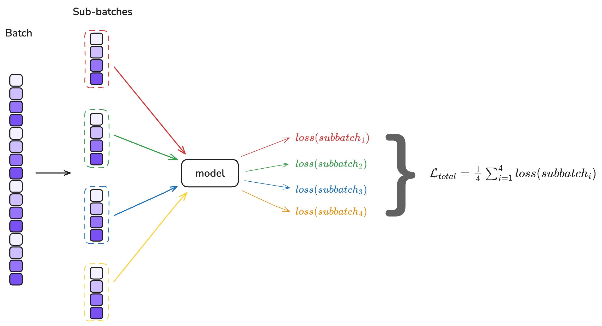
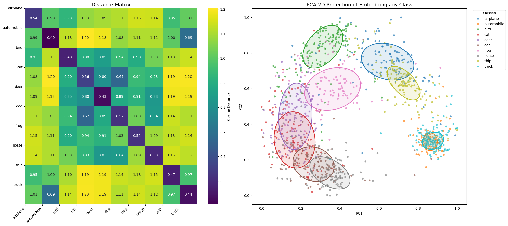
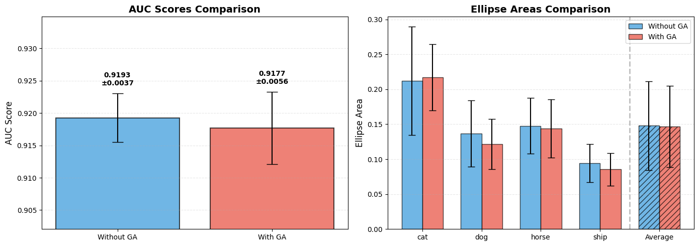

In the previous chapter, we observed that the KoLeo loss successfully spreads embeddings in the representation space. However, we noted that the KoLeo loss is intrinsically dependent on batch size: it computes the minimum distance between each embedding and all other embeddings within the same batch. This batch dependency naturally raises questions about the impact of *gradient accumulation* on training and the quality of embeddings.

## What is Gradient Accumulation?

Gradient accumulation is a technique that allows training with a larger effective batch size when memory constraints limit the actual batch size that can fit in GPU memory. Instead of updating the model weights after processing a single batch, gradient accumulation processes multiple smaller batches** sequentially and then accumulates the gradients from each batch without updating the weights. It will updates the model weights only after processing all accumulated batches.

Mathematically, if we have a batch size of $B$ and accumulate gradients over $N$ batches, the effective batch size becomes $N \times B$. The loss is typically averaged over each batch, and the gradients are summed across all accumulated batches before the weight update.



For a standard loss function like the triplet loss, gradient accumulation is straightforward: the loss is computed independently for each batch, and the gradients can be safely accumulated. However, for batch-dependent losses like the KoLeo loss, the situation is more complex.

The KoLeo loss computes distances between all pairs of embeddings within a batch. When using gradient accumulation, each sub-batch computes its own KoLeo loss based only on embeddings within that sub-batch and then compute a mean of the KoLeo loss for all sub-batches.
This means the KoLeo loss "sees" only the local structure within each sub-batch, not the global structure across the entire effective batch

This raises an important question: **does gradient accumulation affect the behavior of the KoLeo loss, and if so, how does it impact the spread and quality of embeddings?**

## Gradient accumulation in action

### Gradient accumulation with a standard loss (BCE loss)

To illustrate how gradient accumulation works with a standard loss like BCE lets build a small model and instantiate a loss function and an optimizer.


```python
import torch
from torch import nn

seed = 42
torch.manual_seed(seed)
simple_model = nn.Sequential(nn.Linear(2, 3, bias=False), nn.Linear(3, 1, bias=False), nn.Sigmoid())
```


```python
def print_weights(model):
    for name, param in model.named_parameters():
        print(name)
        print("-"*10)
        print(param.data.numpy())

print_weights(simple_model)

```

    0.weight
    ----------
    [[ 0.5406104   0.5869042 ]
     [-0.16565566  0.6495563 ]
     [-0.15492962  0.14268756]]
    1.weight
    ----------
    [[-0.28108588  0.3390678   0.50895905]]


Let's run our model over all a batch of 4 samples.


```python
loss_fn = nn.BCELoss()
batch_input = torch.randn(4, 2)
targets = torch.Tensor([0, 1, 0, 1]).unsqueeze(1)

outputs = simple_model(batch_input)
original_loss = loss_fn(outputs, targets)
print(original_loss.item())
```

    0.5844024419784546


If we want to accumulate the gradients overs 4 sub-batches, each sub-batch will have 1 sample. We run the model 4 times, accumulating the loss of each sub-batch, and compute the mean loss. Here how to do it:


```python
import copy

simple_model_gradacc = copy.deepcopy(simple_model)

grad_accum_steps = 4
sub_batch_size = len(batch_input) // grad_accum_steps
batch_losses = torch.zeros(grad_accum_steps)

for sub_batch_idx in range(grad_accum_steps):
    sub_batch_input = batch_input[(sub_batch_idx * sub_batch_size):((sub_batch_idx + 1) * sub_batch_size), ...]
    sub_batch_targets = targets[(sub_batch_idx * sub_batch_size):((sub_batch_idx + 1) * sub_batch_size), ...]

    sub_batch_outputs = simple_model_gradacc(sub_batch_input)
    sub_batch_loss_gradacc = loss_fn(sub_batch_outputs, sub_batch_targets)
    print(f"loss for sub-batch {sub_batch_idx}: {sub_batch_loss_gradacc}")

    batch_losses[sub_batch_idx] = sub_batch_loss_gradacc

loss_gradacc = batch_losses.mean()
print(f"mean loss: {loss_gradacc.item()}")

```

    loss for sub-batch 0: 0.5325143933296204
    loss for sub-batch 1: 0.5711992383003235
    loss for sub-batch 2: 0.7103754281997681
    loss for sub-batch 3: 0.5235207676887512
    mean loss: 0.5844024419784546


We can see that the mean loss resulting from the gradient accumulation it's exactly the same as the loss computed from the original batch. This works, because the reduction mode of the [BCELoss](https://pytorch.org/docs/stable/generated/torch.nn.BCELoss.html) is `mean` by default.

> `torch.nn.BCELoss(weight=None, size_average=None, reduce=None, reduction='mean')`


If we choose `sum` instead, we will have a total loss equal to the sum of each loss of each sample


```python
batch_losses.sum().item()
```


    2.3376097679138184


```python
loss_sum_fn = nn.BCELoss(reduction='sum')
outputs = simple_model(batch_input)
sum_loss = loss_sum_fn(outputs, targets)
print(sum_loss.item())
```

    2.3376097679138184


Ok, now let's compute the gradients of both models, with and without gradient accumulation.


```python
from torch.optim import SGD

def print_gradients(model):
    for name, param in model.named_parameters():
        if param.grad is not None:
            print(name)
            print("-"*10)
            print(param.grad)


optimizer = SGD(simple_model.parameters(), lr=1)
optimizer.zero_grad()
original_loss.backward(retain_graph=True)
print("Gradients of the model without gradient accumulation:")
print_gradients(simple_model)
print("="*20)

optimizer_gradacc = SGD(simple_model_gradacc.parameters(), lr=1)
optimizer_gradacc.zero_grad()

for sub_batch_idx in range(grad_accum_steps):
    sub_batch_input = batch_input[(sub_batch_idx * sub_batch_size):((sub_batch_idx + 1) * sub_batch_size), ...]
    sub_batch_targets = targets[(sub_batch_idx * sub_batch_size):((sub_batch_idx + 1) * sub_batch_size), ...]

    sub_batch_outputs = simple_model_gradacc(sub_batch_input)
    sub_batch_loss_gradacc = loss_fn(sub_batch_outputs, sub_batch_targets)
    sub_batch_loss_gradacc.backward(retain_graph=True)


print("Gradients of the model with gradient accumulation:")
print_gradients(simple_model_gradacc)
```

    Gradients of the model without gradient accumulation:
    0.weight
    ----------
    tensor([[-0.1107, -0.0319],
            [ 0.1335,  0.0385],
            [ 0.2004,  0.0578]])
    1.weight
    ----------
    tensor([[ 0.2796,  0.0086, -0.0448]])
    ====================
    Gradients of the model with gradient accumulation:
    0.weight
    ----------
    tensor([[-0.4428, -0.1278],
            [ 0.5342,  0.1541],
            [ 0.8018,  0.2314]])
    1.weight
    ----------
    tensor([[ 1.1185,  0.0343, -0.1792]])


The reason we see different gradient values for the model trained with and without gradient accumulation is due to how the loss is scaled in each approach. 

When we process the whole batch at once (without gradient accumulation), the loss function computes the average loss over the entire batch, and backpropagation accumulates gradients based on this average.

However, when we use gradient accumulation and process the batch in smaller sub-batches, we calculate the loss (usually averaged) for each sub-batch and call `.backward()` on each one. This ends up accumulating the gradients for *each sub-batch average* rather than for the full batch average, effectively scaling the gradients by the number of accumulation steps and making them larger than expected.

To fix this we need to ensure that the overall scale of the loss matches between the two methods. The most common way to do this is to divide the loss of each sub-batch by the number of accumulation steps before calling `.backward()`,  
In summary, when using gradient accumulation, always adjust your loss scaling to make sure gradients are computed as if you had done a single backward pass on the whole batch.


```python
optimizer_gradacc.zero_grad()

for sub_batch_idx in range(grad_accum_steps):
    sub_batch_input = batch_input[(sub_batch_idx * sub_batch_size):((sub_batch_idx + 1) * sub_batch_size), ...]
    sub_batch_targets = targets[(sub_batch_idx * sub_batch_size):((sub_batch_idx + 1) * sub_batch_size), ...]

    sub_batch_outputs = simple_model_gradacc(sub_batch_input)
    sub_batch_loss_gradacc = loss_fn(sub_batch_outputs, sub_batch_targets) / grad_accum_steps # scale the loss by the number of accumulation steps
    sub_batch_loss_gradacc.backward(retain_graph=True)
    
print_gradients(simple_model_gradacc)
```

    0.weight
    ----------
    tensor([[-0.1107, -0.0319],
            [ 0.1335,  0.0385],
            [ 0.2004,  0.0578]])
    1.weight
    ----------
    tensor([[ 0.2796,  0.0086, -0.0448]])


We have now the same gradients, we can update our model weights to confirm we have exactly the same thing.


```python
optimizer.step()
optimizer_gradacc.step()

print("Weights of the model without gradient accumulation:")
print_weights(simple_model)
print("Weights of the model with gradient accumulation:")
print_weights(simple_model_gradacc)
```

    Weights of the model without gradient accumulation:
    0.weight
    ----------
    [[ 0.65131354  0.61885107]
     [-0.2991945   0.6110195 ]
     [-0.35537863  0.0848418 ]]
    1.weight
    ----------
    [[-0.56070507  0.33048445  0.5537596 ]]
    Weights of the model with gradient accumulation:
    0.weight
    ----------
    [[ 0.65131354  0.61885107]
     [-0.2991945   0.6110195 ]
     [-0.35537863  0.0848418 ]]
    1.weight
    ----------
    [[-0.56070507  0.33048445  0.5537596 ]]


### Gradient accumulation with KoLeo loss

With a standard loss function like Binary Cross Entropy (BCE), gradient accumulation is straightforward because the loss over a batch is just the mean of the losses over each individual example, and BCE is additive and independent across examples. Given a batch of predictions $\hat{y}$ and targets $y$, the total BCE loss is:

$$
\mathcal{L}_{\text{BCE}} = \frac{1}{N} \sum_{i=1}^N \ell_{\text{BCE}}(\hat{y}_i, y_i)
$$

When we split a batch into sub-batches for gradient accumulation, and scale each sub-batch's loss by $1/$ (number of accumulation steps), the overall gradients are equivalent to those computed on the full batch, because

$$
\frac{1}{K} \sum_{k=1}^K  \sum_{i \in \text{sub-batch}_k}^B \frac{1}{B} \ell_{\text{BCE}}(\hat{y}_i, y_i) = \frac{1}{N}\sum_{i=1}^{N} \ell_{\text{BCE}}(\hat{y}_i, y_i)
$$

where $ N = B \times K $

However, with the KoLeo loss, the situation is more complex. The KoLeo loss for a batch depends not only on individual samples, but on the distances between all possible pairs within the batch. If we split the batch into sub-batches and independently compute the KoLeo loss for each, we lose the pairwise structure across the whole batch. The result is that gradient accumulation with naive sub-batch loss scaling does not yield the same gradients as computing the KoLeo loss over the full batch.


$$
\frac{1}{K} \sum_{k=1}^K ( \frac{1}{B} \sum_{(i,j) \in \text{sub-batch}_k^2} -\log\left( \min_{j \ne i} \| f(x_i) - f(x_j) \| \right)) \neq \frac{1}{N}\sum_{i=1}^{N} -\log\left( \min_{j \ne i} \| f(x_i) - f(x_j) \| \right))
$$

We can verify this programmatically. You can find the utility scripts at https://github.com/adlane98/koleo-study.


```python
from training_utils import KoLeoLoss

koleo_loss = KoLeoLoss()

torch.manual_seed(seed)

simple_model = nn.Sequential(nn.Linear(10, 3, bias=False), nn.Linear(3, 2, bias=False))
inputs = torch.randn(100, 10)
outputs = simple_model(inputs)
print("Loss without gradient accumulation:")
print(koleo_loss(outputs).item())

sub_batch_size = len(inputs) // grad_accum_steps
losses = torch.zeros(grad_accum_steps)
for idx in range(grad_accum_steps):
    sub_batch_inputs = inputs[(idx * sub_batch_size):((idx + 1) * sub_batch_size), ...]
    sub_batch_outputs = simple_model(sub_batch_inputs)
    sub_batch_loss = koleo_loss(sub_batch_outputs)
    losses[idx] = sub_batch_loss

print("Loss with gradient accumulation:")
print(losses.mean().item())
```

    Loss without gradient accumulation:
    4.714231491088867
    Loss with gradient accumulation:
    3.278782844543457


This example confirms that the KoLeo loss differs when computed with or without gradient accumulation. But is this a problem? In real training, can the accumulated KoLeo loss still provide a good enough approximation without breaking the training?

## Integrating gradient accumulation to our code

First, we will train the same network used in chapters 1 and 2, and set the seed to ensure the training is exactly reproducible as at the beginning of chapter 2. We introduce a new hyper-parameter `grad_accum_steps` and we will ensure that `batch_size % grad_accum_steps = 0`. Moreover we make sure that the dataset length is also a multiple of the batch size so we modify the validation split to 0.0524 because `0.0524 x 25000 = 1256` so that we have `25000 - 1256 = 23744` and `23744 % 64 = 0`.


```python
import numpy as np

from training_utils import get_device, load_cifar10, build_triplets, create_datasets


seed = 42
device = get_device()
device = "cpu"
print(f"Device: {device}")

images, labels = load_cifar10("../cifar-10-python")
print(f"Images shape: {images.shape}, Labels shape: {labels.shape}")

np.random.seed(seed)
triplets, triplets_labels = build_triplets(images, labels, n_neg=2500, seed=seed)
print(f"Triplets shape: {triplets.shape}")

batch_size = 64
grad_accum_steps = 4
assert batch_size % grad_accum_steps == 0
sub_batch_size = batch_size // grad_accum_steps

learning_rate = 5e-4
margin = 0.4
koleo_weight = 0.1
val_split = 0.05

train_dataset, val_dataset, val_triplets, val_labels = create_datasets(triplets, triplets_labels, val_split=val_split, seed=seed)

koleo_loss_fn = KoLeoLoss()

print(f"Train: {len(train_dataset)}, Val: {len(val_dataset)}")
```

    Device: cpu
    Images shape: (50000, 32, 32, 3), Labels shape: (50000,)
    Triplets shape: (25000, 3, 32, 32, 3)
    Train: 23750, Val: 1250


We can write the new training loop, and we put the validation loop in `training_utils.py` because it's the same validation loop as in Chapter 2. Note that there are several ways to implement gradient accumulation. For the sake of simplicity, we choose to do it inside the training loop and transfer the data to the device after splitting the whole batch into sub-batches, because a batch size of 64, as we've chosen, fits in our memory. However, in real-world scenarios, the batch size may not fit in your memory, so you would need to either change how the dataloader is implemented or use an approach like [this](https://wandb.ai/wandb_fc/tips/reports/How-To-Implement-Gradient-Accumulation-in-PyTorch--VmlldzoyMjMwOTk5):

```python
optimizer = ...
NUM_ACCUMULATION_STEPS = ...

for epoch in range(...):
    for idx, sample in enumerate(dataloader):
        inputs, labels = sample

        outputs = model(inputs)
        loss = loss_fn(outputs, labels)

        loss = loss / NUM_ACCUMULATION_STEPS
        loss.backward()

        if ((idx + 1) % NUM_ACCUMULATION_STEPS == 0) or (idx + 1 == len(dataloader)):
            optimizer.step()
            optimizer.zero_grad()
```            
We don't use this approach because we want to maintain reproducibility in how the dataloader returns data, at least for the first run.


```python
from tqdm import tqdm
from training_utils import triplet_loss, validation_loop

def train_loop(net, grad_accum_steps, dataloader, optimizer, margin, koleo_weight, print_freq=100):
    net.train()
    loss_accum = 0.0
    epoch_loss = 0.0
    for batch_idx, (anc, pos, neg) in tqdm(enumerate(dataloader)):

        if len(anc) < 64:
            continue
        
        optimizer.zero_grad()

        for sub_batch_idx in range(grad_accum_steps):
            anc_sb = anc[(sub_batch_idx * sub_batch_size):((sub_batch_idx + 1) * sub_batch_size), ...]
            pos_sb = pos[(sub_batch_idx * sub_batch_size):((sub_batch_idx + 1) * sub_batch_size), ...]
            neg_sb = neg[(sub_batch_idx * sub_batch_size):((sub_batch_idx + 1) * sub_batch_size), ...]

            anc_sb, pos_sb, neg_sb = anc_sb.to(device), pos_sb.to(device), neg_sb.to(device)
            anc_feat, pos_feat, neg_feat = net(anc_sb), net(pos_sb), net(neg_sb)

            t_loss = triplet_loss(anc_feat, pos_feat, neg_feat, margin)
            all_embeddings = torch.cat([anc_feat, pos_feat, neg_feat], dim=0)
            k_loss = koleo_loss_fn(all_embeddings)
            if koleo_weight is not None:
                loss = t_loss + koleo_weight * k_loss
            else:
                loss = t_loss
            
            loss = loss / grad_accum_steps
            loss_accum += loss.item()
            epoch_loss += loss.item()
            loss.backward()

        optimizer.step()


        if (batch_idx + 1) % print_freq == 0:
            print(f"Batch {batch_idx+1}: Loss = {loss_accum / print_freq:.4f}")
            loss_accum = 0.0

    return epoch_loss / (batch_idx + 1)
```

Setting up the training folder.


```python
from training_utils import setup_training_dir

epochs = 15

config = {
    "seed": seed, "batch_size": batch_size, "grad_accum_steps": grad_accum_steps, "learning_rate": learning_rate,
    "epochs": epochs, "margin": margin, "koleo_weight": koleo_weight, "val_split": val_split
}
save_dir, metrics_path, csv_headers = setup_training_dir("runs_koleo_gradacc", config)
```

We can launch the training!


```python
import random

from torch.utils.data import DataLoader
from torchvision.models import VGG11_Weights

from training_utils import VGG11Embedding, print_metrics, log_metrics

train_losses = []
val_losses = []
best_auc = 0
best_epoch_path = None

device = "cpu"

random.seed(seed)
np.random.seed(seed)
torch.manual_seed(seed)

if torch.cuda.is_available():
    torch.cuda.manual_seed(seed)
if torch.mps.is_available():
    torch.mps.manual_seed(seed)

gt = torch.Generator()
gt.manual_seed(seed)

val_loader = DataLoader(val_dataset, batch_size=batch_size, shuffle=False)
train_loader = DataLoader(train_dataset, batch_size=batch_size, shuffle=True, generator=gt)

net = VGG11Embedding(weights=VGG11_Weights.IMAGENET1K_V1).to(device)
optimizer = torch.optim.Adam(net.parameters(), lr=learning_rate)

val_metrics = validation_loop(net, val_loader, margin, koleo_weight, device)
print(f"Before training")
print_metrics(val_metrics)
log_metrics(metrics_path, csv_headers, 0, "", val_metrics)

for epoch_idx in range(epochs):
    train_loss = train_loop(net, grad_accum_steps, train_loader, optimizer, margin, koleo_weight)
    val_metrics = validation_loop(net, val_loader, margin, koleo_weight, device)
    val_losses.append(val_metrics['val_loss'])
    train_losses.append(train_loss)
        
    print(f"Epoch {epoch_idx+1} - train_loss: {train_loss:.4f}, val_loss: {val_metrics['val_loss']:.4f}, val_auc: {val_metrics['val_auc']:.4f}")
    print_metrics(val_metrics)
    log_metrics(metrics_path, csv_headers, epoch_idx + 1, train_loss, val_metrics)

    if val_metrics['val_auc'] > best_auc:
        best_auc = val_metrics['val_auc']
        if best_epoch_path is not None:
            best_epoch_path.unlink()
        best_epoch_path = save_dir / f'best_epoch_{epoch_idx+1}.pth'
        torch.save(net.state_dict(), best_epoch_path)
        print(f"New best AUC: {best_auc:.4f} at epoch {epoch_idx+1}")
```


    ---------------------------------------------------------------------------

    KeyboardInterrupt                         Traceback (most recent call last)

    Cell In[14], line 33
         30 net = VGG11Embedding(weights=VGG11_Weights.IMAGENET1K_V1).to(device)
         31 optimizer = torch.optim.Adam(net.parameters(), lr=learning_rate)
    ---> 33 val_metrics = validation_loop(net, val_loader, margin, koleo_weight, device)
         34 print(f"Before training")
         35 print_metrics(val_metrics)


    File ~/perso/koleoLoss-study/training_utils.py:270, in validation_loop(net, dataloader, margin, koleo_weight, device, koleo_loss_fn)
        268 for batch_idx, (anc, pos, neg) in enumerate(dataloader):
        269     anc, pos, neg = anc.to(device), pos.to(device), neg.to(device)
    --> 270     anc_feat, pos_feat, neg_feat = net(anc), net(pos), net(neg)
        272     simple_loss = triplet_loss(anc_feat, pos_feat, neg_feat, margin)
        273     if koleo_weight is not None:


    File ~/perso/koleo/.venv/lib/python3.13/site-packages/torch/nn/modules/module.py:1775, in Module._wrapped_call_impl(self, *args, **kwargs)
       1773     return self._compiled_call_impl(*args, **kwargs)  # type: ignore[misc]
       1774 else:
    -> 1775     return self._call_impl(*args, **kwargs)


    File ~/perso/koleo/.venv/lib/python3.13/site-packages/torch/nn/modules/module.py:1786, in Module._call_impl(self, *args, **kwargs)
       1781 # If we don't have any hooks, we want to skip the rest of the logic in
       1782 # this function, and just call forward.
       1783 if not (self._backward_hooks or self._backward_pre_hooks or self._forward_hooks or self._forward_pre_hooks
       1784         or _global_backward_pre_hooks or _global_backward_hooks
       1785         or _global_forward_hooks or _global_forward_pre_hooks):
    -> 1786     return forward_call(*args, **kwargs)
       1788 result = None
       1789 called_always_called_hooks = set()


    File ~/perso/koleoLoss-study/training_utils.py:120, in VGG11Embedding.forward(self, x)
        119 def forward(self, x):
    --> 120     x = self.features(x)
        121     x = torch.flatten(x, 1)
        122     x = self.linear(x)


    File ~/perso/koleo/.venv/lib/python3.13/site-packages/torch/nn/modules/module.py:1775, in Module._wrapped_call_impl(self, *args, **kwargs)
       1773     return self._compiled_call_impl(*args, **kwargs)  # type: ignore[misc]
       1774 else:
    -> 1775     return self._call_impl(*args, **kwargs)


    File ~/perso/koleo/.venv/lib/python3.13/site-packages/torch/nn/modules/module.py:1786, in Module._call_impl(self, *args, **kwargs)
       1781 # If we don't have any hooks, we want to skip the rest of the logic in
       1782 # this function, and just call forward.
       1783 if not (self._backward_hooks or self._backward_pre_hooks or self._forward_hooks or self._forward_pre_hooks
       1784         or _global_backward_pre_hooks or _global_backward_hooks
       1785         or _global_forward_hooks or _global_forward_pre_hooks):
    -> 1786     return forward_call(*args, **kwargs)
       1788 result = None
       1789 called_always_called_hooks = set()


    File ~/perso/koleo/.venv/lib/python3.13/site-packages/torch/nn/modules/container.py:250, in Sequential.forward(self, input)
        246 """
        247 Runs the forward pass.
        248 """
        249 for module in self:
    --> 250     input = module(input)
        251 return input


    File ~/perso/koleo/.venv/lib/python3.13/site-packages/torch/nn/modules/module.py:1775, in Module._wrapped_call_impl(self, *args, **kwargs)
       1773     return self._compiled_call_impl(*args, **kwargs)  # type: ignore[misc]
       1774 else:
    -> 1775     return self._call_impl(*args, **kwargs)


    File ~/perso/koleo/.venv/lib/python3.13/site-packages/torch/nn/modules/module.py:1786, in Module._call_impl(self, *args, **kwargs)
       1781 # If we don't have any hooks, we want to skip the rest of the logic in
       1782 # this function, and just call forward.
       1783 if not (self._backward_hooks or self._backward_pre_hooks or self._forward_hooks or self._forward_pre_hooks
       1784         or _global_backward_pre_hooks or _global_backward_hooks
       1785         or _global_forward_hooks or _global_forward_pre_hooks):
    -> 1786     return forward_call(*args, **kwargs)
       1788 result = None
       1789 called_always_called_hooks = set()


    File ~/perso/koleo/.venv/lib/python3.13/site-packages/torch/nn/modules/conv.py:548, in Conv2d.forward(self, input)
        547 def forward(self, input: Tensor) -> Tensor:
    --> 548     return self._conv_forward(input, self.weight, self.bias)


    File ~/perso/koleo/.venv/lib/python3.13/site-packages/torch/nn/modules/conv.py:543, in Conv2d._conv_forward(self, input, weight, bias)
        531 if self.padding_mode != "zeros":
        532     return F.conv2d(
        533         F.pad(
        534             input, self._reversed_padding_repeated_twice, mode=self.padding_mode
       (...)    541         self.groups,
        542     )
    --> 543 return F.conv2d(
        544     input, weight, bias, self.stride, self.padding, self.dilation, self.groups
        545 )


    KeyboardInterrupt: 


```python
from pathlib import Path
from training_utils import VGG11Embedding
net = VGG11Embedding()
save_dir = Path("runs_koleo_gradacc/20251230_131112")

best_epoch_path = list((save_dir.glob('best_epoch_*.pth')))[0]
net.load_state_dict(torch.load(best_epoch_path))
```


    <All keys matched successfully>


We can now compare the distance matrix and the embeddings with the ones obtained at chapter 2.


```python
from matplotlib.patches import Ellipse
from matplotlib import pyplot as plt
import pandas as pd
import seaborn as sns

def plot_distance_matrix_and_embeddings(
    dist_matrix,
    embeddings_2d,
    ellipse_params,
    labels_array,
    label_names,
    save_path=None,
    title_suffix="",
):
    fig, axes = plt.subplots(1, 2, figsize=(20, 9))
    
    col_labels = [f"{label_names[i]}" for i in range(len(label_names))]
    row_labels = [f"{label_names[i]}" for i in range(len(label_names))]
    
    sns.heatmap(
        dist_matrix,
        xticklabels=col_labels,
        yticklabels=row_labels,
        annot=True,
        fmt='.2f',
        cmap='viridis',
        cbar_kws={'label': 'Cosine Distance'},
        ax=axes[0]
    )
    
    axes[0].set_title(f'Distance Matrix{title_suffix}', fontsize=14)
    axes[0].set_xticks(range(len(col_labels)))
    axes[0].set_xticklabels(col_labels, rotation=45, ha='right')
    axes[0].set_yticks(range(len(row_labels)))
    axes[0].set_yticklabels(row_labels, rotation=0)
    
    pca_2d_df = pd.DataFrame({
        'PC1': embeddings_2d[:, 0],
        'PC2': embeddings_2d[:, 1],
        'Label': labels_array,
        'Class': [label_names[int(label)] for label in labels_array]
    })
    
    palette = sns.color_palette("tab10", n_colors=10)
    class_names = sorted(pca_2d_df['Class'].unique())
    color_map = {cls: palette[i] for i, cls in enumerate(class_names)}
    
    sns.scatterplot(
        data=pca_2d_df, x='PC1', y='PC2',
        hue='Class', palette=color_map,
        alpha=0.7, s=30, ax=axes[1]
    )
    
    for cls in class_names:
        ep = ellipse_params[cls]
        center, w, h, angle = ep["center"], ep["width"], ep["height"], ep["angle"]
        color = color_map[cls]
        
        ellipse = Ellipse(
            xy=center, width=w, height=h, angle=angle,
            facecolor=(*color, 0.12), edgecolor=color, linewidth=2
        )
        axes[1].add_patch(ellipse)
    
    axes[1].set_xlabel('PC1')
    axes[1].set_ylabel('PC2')
    axes[1].set_title(f'PCA 2D Projection of Embeddings by Class{title_suffix}', fontsize=14)
    axes[1].legend(title='Classes', bbox_to_anchor=(1.02, 1), loc='upper left')
    
    plt.tight_layout()
    
    if save_path is not None:
        plt.savefig(save_path, dpi=150, bbox_inches='tight')
        print(f"Combined plot saved at {save_path}")
    
    plt.show()
    plt.close()
    
    same_class_dists = np.diag(dist_matrix)
    diff_class_dists = []
    for i in range(len(label_names)):
        for j in range(len(label_names)):
            if i != j:
                diff_class_dists.append(dist_matrix[i, j])
    
    print(f"\nIntra-class distance: mean={np.mean(same_class_dists):.4f}, std={np.std(same_class_dists):.4f}")
    print(f"Inter-class distance: mean={np.mean(diff_class_dists):.4f}, std={np.std(diff_class_dists):.4f}")
    print(f"Separation margin: {np.mean(diff_class_dists) - np.mean(same_class_dists):.4f}")


```


```python
from matplotlib import pyplot as plt
from sklearn.decomposition import PCA

from plot_utils import compute_distance_matrix, get_ellipse_params_per_class
from training_utils import VAL_TRANSFORMS, construct_embeddings_by_class, LABEL_NAMES


embeddings_by_class = construct_embeddings_by_class(net, val_labels, val_triplets, VAL_TRANSFORMS, device)
dist_matrix = compute_distance_matrix(embeddings_by_class)

all_embeddings = torch.cat([embeddings_by_class[k] for k in embeddings_by_class], dim=0)

pca_2d = PCA(n_components=2)
embeddings_2d = pca_2d.fit_transform(all_embeddings)
embeddings_2d = (embeddings_2d - embeddings_2d.min(axis=0)) / (embeddings_2d.max(axis=0) - embeddings_2d.min(axis=0))
samples_per_class = [len(embeddings_by_class[i]) for i in range(10)]

labels_array = np.concatenate([np.full(count, label) for label, count in enumerate(samples_per_class)])
ellipse_params = get_ellipse_params_per_class(embeddings_2d, labels_array, LABEL_NAMES, coverage=0.5)

plot_distance_matrix_and_embeddings(dist_matrix, embeddings_2d, ellipse_params, labels_array, LABEL_NAMES, save_path=save_dir / "distance_matrix_and_embeddings_gradacc.png")

```

    Combined plot saved at runs_koleo_gradacc/20251230_131112/distance_matrix_and_embeddings_gradacc.png


    

    


    
    Intra-class distance: mean=0.4854, std=0.0488
    Inter-class distance: mean=1.0279, std=0.1357
    Separation margin: 0.5425


<div style="display: flex; gap: 10px;">
  
  
</div>

Here a table summarizing result we got in the two previous chapters. 

| Metric | Without KoLeo | With KoLeo | With KoLeo and gradient accumulation | 
|--------|---------------|------------|------------|
| Intra-class distance | mean=0.2249, std=0.0865 | mean=0.5202, std=0.0545 | mean=0.4854, std=0.0488 |
| Inter-class distance | mean=1.0392, std=0.2285 | mean=1.0350, std=0.1244 | mean=1.0279, std=0.1357 |
| Separation margin | 0.8143 | 0.5147 | 0.5425 |


With gradient accumulation, the results seem to be equivalent to training with only KoLeo, but it's too early to draw such a conclusion. To confirm this, we will perform a new K-Fold training.

## K-Fold training

First, we will initialize the K-Fold training. We also choose the number of negative samples to keep when building the triplets dataset to ensure that every batch, even the last one, contains exactly 64 samples. Indeed, if we keep 2500 negative samples, we would have 25000 samples total, and `25000 * 0.95 = 23750` samples for training. However, with 23750 samples and a batch size of 64, the last batch will contain only 6 samples, because `23750 % 64 = 6`. Since we have gradient accumulation steps of 4, each sub-batch will contain 16 triplets, except for the last 4 sub-batches. The first of those 4 will contain 6 samples, and the next ones 0 because there are no more triplets. There are not enough triplets in the last batch.


```python
import numpy as np
from training_utils import build_triplets,load_cifar10
images, labels = load_cifar10("../cifar-10-python")

np.random.seed(seed)
triplets, triplets_labels = build_triplets(images, labels, n_neg=2432, seed=seed)
print(triplets.shape)
```

    (24320, 3, 32, 32, 3)


```python
from sklearn.model_selection import KFold

import copy

K_FOLDS = 5
EPOCHS_PER_FOLD = 7

kfold = KFold(n_splits=K_FOLDS, shuffle=True, random_state=seed)

device = get_device()

results_no_gradacc = {"areas": {cls: [] for cls in LABEL_NAMES}, "auc": []}
results_with_gradacc = {"areas": {cls: [] for cls in LABEL_NAMES}, "auc": []}

```


```python
from training_utils import train_and_compute_metrics

for fold_idx, (train_idx, val_idx) in enumerate(kfold.split(triplets)):
    print(f"\n{'='*50}")
    print(f"Fold {fold_idx + 1}/{K_FOLDS}")
    print(f"{'='*50}")
    
    fold_train_triplets = triplets[train_idx]
    fold_val_triplets = triplets[val_idx]
    fold_train_labels = triplets_labels[train_idx]
    fold_val_labels = triplets_labels[val_idx]
    
    print(f"Training WITHOUT gradient accumulation...")
    metrics_no_gradacc = train_and_compute_metrics(
        fold_train_triplets, 
        fold_val_triplets, 
        fold_val_labels,
        epochs=EPOCHS_PER_FOLD, 
        koleo_weight=0.1, 
        grad_accum_steps=4, 
    )
    for cls in LABEL_NAMES:
        results_no_gradacc["areas"][cls].append(metrics_no_gradacc["areas"][cls])
    results_no_gradacc["auc"].append(metrics_no_gradacc["auc"])
    print(f"  Best AUC: {metrics_no_gradacc['auc']:.4f}")
    
    print(f"Training WITH gradient accumulation...")
    metrics_with_gradacc = train_and_compute_metrics(
        fold_train_triplets, 
        fold_val_triplets, 
        fold_val_labels,
        epochs=EPOCHS_PER_FOLD, 
        koleo_weight=0.1, 
        grad_accum_steps=1, 
    )
    for cls in LABEL_NAMES:
        results_with_gradacc["areas"][cls].append(metrics_with_gradacc["areas"][cls])
    results_with_gradacc["auc"].append(metrics_with_gradacc["auc"])
    print(f"  Best AUC: {metrics_with_gradacc['auc']:.4f}")
    
    print(f"Fold {fold_idx + 1} done.")
```

    
    ==================================================
    Fold 1/5
    ==================================================
    Training WITHOUT gradient accumulation...


    100%|█████████████████████████████████████████████████████████████████████████████████████████████████████████████████| 7/7 [05:55<00:00, 50.82s/it]


      Best AUC: 0.9135
    Training WITH gradient accumulation...


    100%|█████████████████████████████████████████████████████████████████████████████████████████████████████████████████| 7/7 [04:03<00:00, 34.83s/it]


      Best AUC: 0.9149
    Fold 1 done.
    
    ==================================================
    Fold 2/5
    ==================================================
    Training WITHOUT gradient accumulation...


    100%|█████████████████████████████████████████████████████████████████████████████████████████████████████████████████| 7/7 [06:21<00:00, 54.52s/it]


      Best AUC: 0.9210
    Training WITH gradient accumulation...


    100%|█████████████████████████████████████████████████████████████████████████████████████████████████████████████████| 7/7 [04:28<00:00, 38.37s/it]


      Best AUC: 0.9136
    Fold 2 done.
    
    ==================================================
    Fold 3/5
    ==================================================
    Training WITHOUT gradient accumulation...


    100%|██████████████████████████████████████████████████████████████████████████████████████████████████████████████| 7/7 [1:23:34<00:00, 716.40s/it]


      Best AUC: 0.9165
    Training WITH gradient accumulation...


    100%|█████████████████████████████████████████████████████████████████████████████████████████████████████████████████| 7/7 [04:00<00:00, 34.40s/it]


      Best AUC: 0.9235
    Fold 3 done.
    
    ==================================================
    Fold 4/5
    ==================================================
    Training WITHOUT gradient accumulation...


    100%|████████████████████████████████████████████████████████████████████████████████████████████████████████████████| 7/7 [21:25<00:00, 183.57s/it]


      Best AUC: 0.9239
    Training WITH gradient accumulation...


    100%|█████████████████████████████████████████████████████████████████████████████████████████████████████████████████| 7/7 [04:02<00:00, 34.60s/it]


      Best AUC: 0.9251
    Fold 4 done.
    
    ==================================================
    Fold 5/5
    ==================================================
    Training WITHOUT gradient accumulation...


    100%|█████████████████████████████████████████████████████████████████████████████████████████████████████████████████| 7/7 [05:50<00:00, 50.04s/it]


      Best AUC: 0.9215
    Training WITH gradient accumulation...


    100%|█████████████████████████████████████████████████████████████████████████████████████████████████████████████████| 7/7 [04:36<00:00, 39.54s/it]


      Best AUC: 0.9111
    Fold 5 done.


## Results

As in Chapter 2, we analyze the results from the K-Fold cross-validation by comparing the AUC scores and ellipse areas between the two conditions: training without gradient accumulation and training with gradient accumulation. 


```python
auc_no_gradacc = np.array(results_no_gradacc["auc"])
auc_with_gradacc = np.array(results_with_gradacc["auc"])

print("=" * 70)
print("AUC SCORES")
print("=" * 70)
print(f"Without gradient accumulation: {auc_no_gradacc.mean():.4f} +/- {auc_no_gradacc.std():.4f}")
print(f"With gradient accumulation: {auc_with_gradacc.mean():.4f} +/- {auc_with_gradacc.std():.4f}")

print("\n" + "=" * 70)
print("ELLIPSE AREAS")
print("=" * 70)
print(f"{'Class':<12} | {'Without KoLeo (mean +/- std)':<25} | {'With KoLeo (mean +/- std)':<25}")
print("-" * 70)

for cls in ["cat", "dog", "horse", "ship"]:
    no_gradacc_arr = np.array(results_no_gradacc["areas"][cls])
    with_gradacc_arr = np.array(results_with_gradacc["areas"][cls])
    
    print(f"{cls:<12} | {no_gradacc_arr.mean():.4f} +/- {no_gradacc_arr.std():.4f}        | {with_gradacc_arr.mean():.4f} +/- {with_gradacc_arr.std():.4f}")

print("\n" + "=" * 70)
print("Average area across all classes:")

all_no_gradacc = np.array([np.mean(results_no_gradacc["areas"][cls]) for cls in LABEL_NAMES])
all_with_gradacc = np.array([np.mean(results_with_gradacc["areas"][cls]) for cls in LABEL_NAMES])

print(f"  Without gradient accumulation: {all_no_gradacc.mean():.4f} +/- {all_no_gradacc.std():.4f}")
print(f"  With gradient accumulation: {all_with_gradacc.mean():.4f} +/- {all_with_gradacc.std():.4f}")
```

    ======================================================================
    AUC SCORES
    ======================================================================
    Without gradient accumulation: 0.9193 +/- 0.0037
    With gradient accumulation: 0.9177 +/- 0.0056
    
    ======================================================================
    ELLIPSE AREAS
    ======================================================================
    Class        | Without KoLeo (mean +/- std) | With KoLeo (mean +/- std)
    ----------------------------------------------------------------------
    cat          | 0.2119 +/- 0.0773        | 0.2169 +/- 0.0473
    dog          | 0.1369 +/- 0.0475        | 0.1217 +/- 0.0358
    horse        | 0.1474 +/- 0.0399        | 0.1438 +/- 0.0415
    ship         | 0.0944 +/- 0.0272        | 0.0856 +/- 0.0233
    
    ======================================================================
    Average area across all classes:
      Without gradient accumulation: 0.1479 +/- 0.0633
      With gradient accumulation: 0.1464 +/- 0.0581


```python
from plot_utils import plot_auc_and_ellipse_areas

plot_auc_and_ellipse_areas(
    results_no_gradacc,
    results_with_gradacc,
    ["Without GA", "With GA"],
    LABEL_NAMES,
)
```


    

    


### Conclusion of K-Fold Training

The K-Fold cross-validation results provide strong statistical evidence that gradient accumulation does not significantly degrade the performance of models trained with the KoLeo loss. The small difference between the two AUC scores falls well within the standard deviations, indicating that the discrimination ability of the model remains essentially unchanged.

Similarly, the ellipse areas show remarkable consistency across both training strategies, demonstrating that the spread of embeddings in the representation space is preserved. This finding is particularly important because it suggests that even though the KoLeo loss is computed independently on each sub-batch during gradient accumulation, the accumulated effect still achieves the desired regularization objective of spreading embeddings uniformly.

## Conclusion

In this chapter, we investigated the impact of gradient accumulation on the KoLeo loss, a batch-dependent regularization technique. We began by demonstrating that gradient accumulation fundamentally changes how the KoLeo loss is computed: when a batch is split into sub-batches, each sub-batch computes its own KoLeo loss based only on the embeddings within that sub-batch, rather than considering the global structure across the entire effective batch.

Through a single training run, we observed that models trained with gradient accumulation produced embeddings with similar characteristics to those trained without it, suggesting that the approximation might be sufficient for practical purposes. To validate this observation statistically, we performed a 5-fold cross-validation experiment comparing both training strategies.

The K-Fold results confirmed our initial observation: gradient accumulation does not significantly impact either the discrimination quality (AUC scores) or the spread of embeddings (ellipse areas). This demonstrates that the local structure captured within each sub-batch during gradient accumulation is sufficient to maintain the beneficial effects of the KoLeo loss.

## Overall Conclusion

Throughout this series of articles, we have conducted a comprehensive study of siamese networks trained with triplet loss and the KoLeo regularization, exploring both the theoretical foundations and practical implications of batch-dependent losses.

In **Chapter 1**, we established the baseline by training a Siamese network with triplet loss alone on CIFAR-10. We demonstrated that the model successfully learns to separate classes in the embedding space, with good discrimination quality and clear visual separation as shown in the distance matrix and PCA projections. The embeddings showed compact intra-class clusters.

In **Chapter 2**, we introduced the KoLeo loss as a regularization technique to encourage a more uniform distribution of embeddings. Through K-Fold cross-validation, we confirmed that the KoLeo loss successfully achieves its objective: embeddings spread more uniformly in the representation space, with ellipse areas increasing by approximately 59% on average. We also investigated the effect of the KoLeo loss weight parameter, revealing a clear trade-off between embedding spread and discrimination quality.

In **Chapter 3**, we addressed a critical practical concern: the impact of gradient accumulation on the batch-dependent KoLeo loss. We demonstrated that while gradient accumulation fundamentally changes how the KoLeo loss is computed (processing sub-batches independently rather than considering the full batch), the practical impact is negligible. Through K-Fold validation, we showed that both AUC scores and embedding distributions remain essentially unchanged when using gradient accumulation, validating its use in memory-constrained scenarios.

Taken together, these three chapters provide a complete picture of how to effectively use the KoLeo loss in practice: it successfully spreads embeddings while maintaining discrimination quality, and it can be safely combined with gradient accumulation when needed. The batch-dependent nature of the loss, while theoretically important, does not prevent its practical application in real-world training scenarios.

## Next Steps

The very goal of this study was not to find the best model, but to demonstrate the effect of the KoLeo loss and the impact of gradient accumulation. Nevertheless, it's interesting to consider what the best model might look like.

Throughout our experiments, we chose fixed values for the learning rate (5e-4), margin (0.4), and KoLeo weight (0.1) based on preliminary testing, rather than through thorough optimization. Although we have shown that the KoLeo loss works well and is compatible with gradient accumulation, the question of optimal hyperparameter choices remains open.

As a logical next step, it would be valuable to carry out a systematic hyperparameter search to identify the best configuration for maximizing the AUC score, with or without KoLeo Loss, with or without gradient accumulation. 


